# 
 强化学习
---
## 一、导论
### 1.强化学习的概念与特征
#### 概念
智能体与环境进行交互（采样），在不断的尝试中学习“做什么”，使收益最大化（最优策略）。
#### 特征
- 试错探索：不会获知应采取的行动，通过尝试获得；
- 延迟收益：一个动作的收益可能无法短期体现，而是长期浮现。
#### 特征拓展
- 环境不确定性：当前动作不但会影响当前收益，还会影响后续环境，进而影响后续收益。
- 影响未知性：无法预测动作的影响，需要与环境频繁交互。
- 目标可以判断进展。
- 经验可以改进性能。
### 2.机器学习范式
#### 三种范式
- 有监督学习：有标签，注重推断与泛化能力。
- 无监督学习：无标签，寻找数据隐含结构。
- 强化学习：动作影响未知，适于在交互中学习。
#### 区别特征
- 试探（开拓动作空间）与开发/贪心（根据经验获得收益）的折中。
- 智能体与不确定环境交互的完整性、实时性与目标导向性。
### 3.强化学习要素
- 状态：强化学习依赖的概念。
- 策略：在特定时间的行为方式。
- 收益信号：短期的学习目标，环境给予智能体的信号。
- 价值函数：长期的收益累计，需综合评估，其评估方法是强化学习最重要的组成部分。可以使用智能算法或神经网络等方法隐式地计算。
- 环境模型（非必需）：模拟环境的反应。
### 4.强化学习分类
1. 模型
   - 有模型：规划
   - 无模型：试错
2. 策略更新方法
   - 值函数：求解值函数重构策略
   - 直接搜索策略：搜索策略空间
   - Actor-Critic方法：策略迭代，同时逼近值函数和策略
3. 回报函数
   - 正向强化学习：从回报到策略
   - 逆向强化学习：从专家示例到回报
4. 任务体量
   - 分层强化学习：大规模
   - 元强化学习、多目标强化学习、多任务强化学习：多任务
   - 多智能体强化学习：博弈
   - 迁移学习
### 5.强化学习的历史与发展
1. 源于动物学习心理学的试错法
   - 效应定律（Edward Thorndike）
   - 条件反射（巴普洛夫）
   - 快乐-痛苦系统（图灵）
   - 向“老师”学习到向“评论家”学习
   - 自动学习机（M.L.Tsetlin）
   - 经济学
   - 分类器系统，包含功劳分配的救火队算法和演化的遗传算法（John Holland）
2. 最优控制问题的价值函数和动态规划
   - 贝尔曼方程与马尔可夫决策过程（Markov decidion process, MDP）（Richard Bellman）
   - 维度灾难
3. 时序差分方法
   - 次级强化物
   - 广义强化（Klopf）
   - 与试错法结合：“行动器-评判器”结构（Sutton）
   - 与最优控制结合：Q-learning（Chris Watkins）
4. 历史：值函数->直接搜索策略->深度强化学习
5. 发展趋势
   - 与深度学习结合
   - 与专业知识结合
   - 理论分析增强
   - 与脑科学、认知科学结合
---
## 二、有限马尔可夫决策过程
### 1.交互
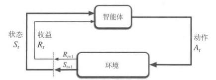
- 动作（A）：智能体做出的选择，集合构成动作空间
- 状态（S）：选择的基础，集合构成状态空间
- 收益（R）：目标

它们的集合都含有限元素。
#### 马尔可夫性（Markov Property）
未来状态仅依赖于当前状态，而独立于过去状态，即“无记忆性”。

$ S_t $、$ R_t $只依赖于$ S_{t-1} $和$ A_{t-1} $，服从离散概率分布：
$$
p(s', r|s, a) \doteq \Pr\{S_t = s', R_t = r|S_{t-1} = s, A_{t-1} = a\}
$$
即$ S_t $、$ R_t $的所有可能组合的概率何为1。
#### 状态转移
$$ 
p(s'|s, a) \doteq \Pr\{S_t = s'|S_{t-1} = s, A_{t-1} = a\} = \sum_{r \in \mathcal{R}} p(s', r|s, a)
$$
其表示，在当前状态和动作下，转移到某个状态的概率，包括该状态下各可能收益情况。

$$
r(s, a) \doteq \mathbb{E}[R_t|S_{t-1} = s, A_{t-1} = a] = \sum_{r \in \mathcal{R}} r \sum_{s' \in \mathcal{S}} p(s', r|s, a)
$$
和
$$ 
r(s, a, s') \doteq \mathbb{E}[R_t|S_{t-1} = s, A_{t-1} = a, S_t = s'] = \sum_{r \in \mathcal{R}} r \frac{p(s', r|s, a)}{p(s'|s, a)}
$$
分别给出了期望收益，后者相较于前者，指定了未来的状态。

状态转移图、表：

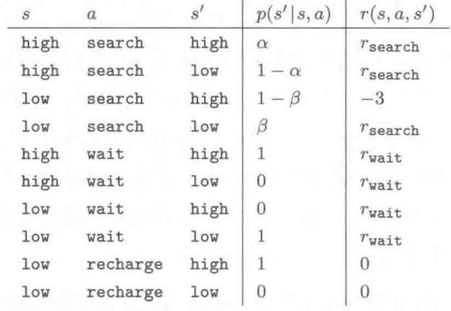
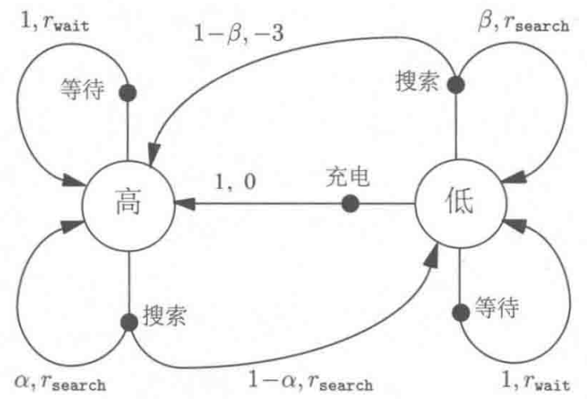

（节点不能重复）
#### 构建要点
- 确定动作、状态、收益。
- 奖励与惩罚：相对而言的，可以全奖励或全惩罚。
- 同一问题可能有多层次的MDP。
- 不同状态的可行动作设置：利用先验知识，人为排除愚蠢动作。
### 2.目标和收益
目标是最大化长期累计收益。

收益信号不含有先验知识，不为达到子目标而舍弃最终目标。
### 3.回报与分幕
回报是收益的总和。
#### 分幕式任务
具有分幕重复特性的任务，下一个幕的开始状态与上一个幕的终结状态无关。

回报可以写作以下公式：
$$
G_t = R_{t+1} + R_{t+2} + R_{t+3} + \cdots + R_T
$$
其中，$ G_t $是回报，$ R_t $是一个幕的收益，$ T $是最终时刻。

非终结状态集$ S $和所有状态集$ S^+ $。
#### 持续性任务
持续不断地发生，不能自然地分幕，最终时刻趋于无穷。

回报可以写作以下公式：
$$
\begin{align*}
G_t & = R_{t+1} + \gamma R_{t+2} + \gamma^2 R_{t+3} + \cdots \\
    & = \sum_{k=0}^{\infty} \gamma^k R_{t+k+1} \\
    & = R_{t+1} + \gamma G_{t+1}
\end{align*}
$$
其中，$ \gamma $是折扣率，$ 0 \leq \gamma \leq 1 $，其越大代表越考虑长期收益。
#### 统一表示
在有限项最后，终止时刻的状态保持转移回自己，相当于无限项。

统一表示公式为：
$$
G_t \doteq \sum_{k=t+1}^{T} \gamma^{k-t-1} R_k
$$
### 4.策略和价值函数
状态价值函数（策略$ \pi $下状态$ s $的价值）：
$$
\begin{align*}
v_\pi(s) &\doteq \mathbb{E}_\pi[G_t|S_t = s] = \mathbb{E}_\pi[\sum_{k=0}^{\infty} \gamma^k R_{t+k+1}|S_t = s, A_t = a]\\
         &= \mathbb{E}_\pi[R_{t+1} + \gamma G_{t+1}|S_t = s] \\
         &= \sum_a \pi(a|s) \sum_{s'} \sum_r p(s', r|s, a)[r + \gamma \mathbb{E}_\pi[G_{t+1}|S_{t+1} = s']] \\
         &= \sum_a \pi(a|s) \sum_{s', r} p(s', r|s, a)[r + \gamma v_\pi(s')], s \in S
\end{align*}
$$
其中最后一行为贝尔曼方程，表达了前后状态价值间的关系。

动作价值函数（策略$ \pi $下在状态$ s $采取动作$ a $的价值）：
$$
q_\pi(s, a) \doteq \mathbb{E}_\pi[G_t|S_t = s, A_t = a] = \mathbb{E}_\pi[\sum_{k=0}^{\infty} \gamma^k R_{t+k+1}|S_t = s, A_t = a]
$$
#### 回溯算法
后继状态的价值信息回传给当前状态。下图给出了回溯图实例。

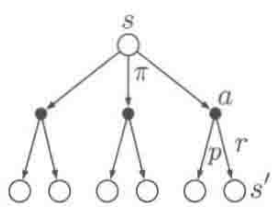

（节点可以重复）
#### 最优策略
价值函数定义了策略的偏序关系，最优策略存在且可能不唯一。
最优策略共享最优状态价值函数和最优动作价值函数，分别如下：
$$ v_*(s) \doteq \max_{\pi} v_{\pi}(s) $$
$$ q_*(s, a) \doteq \max_{\pi} q_{\pi}(s, a) $$
将前者代入后者，得到状态-动作的二元组，可表示为：
$$ q_*(s, a) = \mathbb{E}[R_{t+1} + \gamma v_*(S_{t+1}) \,\bigg|\, S_t = s, A_t = a] $$
在最优策略下，各状态的价值一定等于其下最优动作的期望回报，这是贝尔曼最优方程的关键。
以下的连等式给出了$ v_* $和$ q_* $的贝尔曼最优方程的两种形式：
$$
\begin{align*}
v_*(s) &= \max_{a \in \mathcal{A}(s)} q_{\pi_*}(s, a) \\
&= \max_a \mathbb{E}[R_{t+1} + \gamma v_*(S_{t+1}) \,\bigg|\, S_t = s, A_t = a] \\
&= \max_a \sum_{s', r} p(s', r|s, a)[r + \gamma v_*(s')]
\end{align*}
$$
$$
\begin{align*}
q_*(s, a) 
&= \mathbb{E}[R_{t+1} + \gamma \max_{a'} q_*(S_{t+1}, a') \,\bigg|\, S_t = s, A_t = a] \\
&= \sum_{s', r} p(s', r|s, a)[r + \gamma \max_{a'} q_*(s', a')]
\end{align*}
$$
它们分别对应以下回溯图：

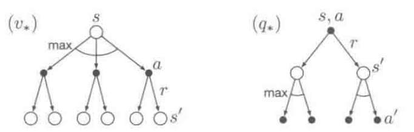

贝尔曼最优方程是一个方程组，其方程数量对应状态数，如果环境的动态变化特性$p$已知，则可以求解。

由于每个状态的价值已包含长期回报，可以使用贪心策略选取每个状态的最优动作。

显示求解贝尔曼最优方程需要知道环境的动态变化特性，有足够的计算资源并具有马尔可夫性，其类似于穷举法，一般很难满足。一般选择近似求解，如启发式搜索、动态规划等方法。

---
## 三、贝尔曼方程与贝尔曼最优方程
### 1.贝尔曼方程
$$
v_\pi(s) = \sum_a \pi(a|s) \sum_{s', r} p(s', r|s, a) \left[ r + \gamma v_\pi(s') \right], s \in S
$$
可化简为$ v = r_\pi + \gamma P_\pi v $，其说明一个状态依赖其他状态值。
### 2.贝尔曼最优方程
元素形式：$ v(s) = \max_{\pi} \sum_{s \in S}\pi(a|s)q(s,a),s \in S $
矩阵向量形式：$ v = \max_{\pi} (r_\pi + \gamma P_\pi v) $
#### 收缩映射定理
对于$ f(x) = x $，若$ f(x) $是收缩映射，则存在一个不动点$ x^* $满足$ f(x^*) = x^* $，这个$ x^* $唯一。针对$ x_{k + 1} = f(x_k) $，在$ x_k \to x^*, k \to \infty $的过程中，收敛速度成指数级增长。

证明：
- 存在性：$ ||x_{k + 1} - x_k|| = ||f(x_{k + 1}) - f(x_k)|| \leq \gamma||x_k - x_{k - 1}|| \leq \dots \leq \gamma^k||x_1 - x_0|| $，由于$ \gamma < 1 $，$ \gamma^k \to 0 $，所以$ x_{k + 1} - x_k \to 0 $。同理可得$ ||x_m - x_n|| \leq \frac{\gamma^n}{1 - \gamma}||x_1 - x_0|| \to 0 $。进而得到$ \{x_k\} $是一个收敛数列，存在$ \lim_{k \to \infty} x_k = x^* $。
- 唯一性：$ ||f(x_k) - x_k|| = ||x_{k + 1} - x_k||$，其快速收敛到$ 0 $，则在极限处有不动点$ f(x^*) = x^* $。可假设存在另一个不动点，最终会得到其与该不动点相等。
- 指数级收敛：$ ||x^* - x_n|| = \lim_{m \to \infty}||x_m - x_n|| \leq  \frac{\gamma^n}{1 - \gamma}||x_1 - x_0|| \to 0 $，这种收敛是指数级的。

这个定理可以判断非线性方程的解是否存在，还可以提出求解方程的数值算法。
#### 贝尔曼最优方程的伸缩映射性
贝尔曼最优方程有伸缩映射性。

证明：
对任意两个$ v1,v2 $，有其对应的贝尔曼最优方程$ \pi_1^* \doteq \arg \max_{\pi} (r_\pi + \gamma P_\pi v_1) $，$ \pi_2^* \doteq \arg \max_{\pi} (r_\pi + \gamma P_\pi v_2) $，有：
$$
f(v_1) = \max_{\pi} (r_\pi + \gamma P_\pi v_1) = r_{\pi_1^*} + \gamma P_{\pi_1^*} v_1 \geq r_{\pi_2^*} + \gamma P_{\pi_2^*} v_1 \\
f(v_2) = \max_{\pi} (r_\pi + \gamma P_\pi v_2) = r_{\pi_2^*} + \gamma P_{\pi_2^*} v_2 \geq r_{\pi_1^*} + \gamma P_{\pi_1^*} v_2 
$$
则：
$$
\begin{align*}
f(v_1) - f(v_2) 
&= r_{\pi_1^*} + \gamma P_{\pi_1^*} v_1 - (r_{\pi_2^*} + \gamma P_{\pi_2^*} v_2) \\
&\leq r_{\pi_1^*} + \gamma P_{\pi_1^*} v_1 - (r_{\pi_1^*} + \gamma P_{\pi_1^*} v_2) \\&
= \gamma P_{\pi_1^*} (v_1 - v_2)
\end{align*}
$$
同理有$ f(v_2) - f(v_1) \leq \gamma P_{\pi_2^*} (v_2 - v_1) $，
故$ \gamma P_{\pi_2^*} (v_1 - v_2)\leq f(v_1) - f(v_2) \leq \gamma P_{\pi_1^*} (v_1 - v_2) $，
取边界极值$ z $，有$ -z \leq f(v_1) - f(v_2) \leq z $，有$ |f(v_1) - f(v_2)| \leq z $，即$ ||f(v_1) - f(v_2)||_\infty \leq ||z||_\infty $。
又有$ ||z||_\infty = max_i |z_i| \leq \gamma ||v_1 - v_2||_\infty $，所以$ ||f(v_1) - f(v_2)||_\infty \leq \gamma ||v_1 - v_2||_\infty $。
由上一个定理可知，贝尔曼最优方程有伸缩映射性。
#### 贝尔曼最优方程的唯一解——值迭代与策略迭代
贝尔曼最优方程$ v = f(v) = \max_{\pi \in \Pi} (r_\pi + \gamma P_\pi v) $，存在唯一解$ v^* $，其能通过$ v_{k + 1} = f(v_k) = \max_{\pi \in \Pi} (r_\pi + \gamma P_\pi v_k) $迭代求解，这一过程称为值迭代。由此可以获得$ v^* $对应的策略$ \pi^* = \arg \max_{\pi \in \Pi} (r_\pi + \gamma P_\pi v^*) $。$ v*, \pi^* $是相对应的，即$ v^* = v_{\pi^*} $。
#### 解的最优性
$ v*, \pi^* $具有最优性，即$ v^* = v_{\pi^*} \geq v_{\pi} $。

证明：
由$ v_{\pi} = r_{\pi} + \gamma P_{\pi} v_{\pi} $，
和$ v^* = \max_{\pi} (r_{\pi} + \gamma P_{\pi} v^*) = r_{\pi^*} + \gamma P_{\pi^*} v^* \geq r_{\pi} + \gamma P_{\pi} v^* $，
可得$ v^* - v_{\pi} \geq (r_{\pi} + \gamma P_{\pi} v^*) - (r_{\pi} + \gamma P_{\pi} v_{\pi}) = \gamma P_{\pi} (v^* - v_{\pi}) $，
即有$ v^* - v_{\pi} \geq \gamma P_{\pi} (v^* - v_{\pi}) \geq \dots \geq \gamma^n P_{\pi}^n (v^* - v_{\pi}) $，
由于$ \gamma < 0 $，$ \forall p_{ij} \in P_{\pi}, p_{ij} \leq 1 $，$ \lim_{n \to \infty} \gamma^n P_{\pi}^n (v^* - v_{\pi}) $趋于0，所以$ v^* \geq v_{\pi} $。
#### 贪婪最优策略
以下贪婪选择策略是贝尔曼方程的最优解：
$$
\pi^*(a|s) 
= \begin{cases}
1, & a = a^*(s), \\
0, & a 
eq a^*(s).
\end{cases}
$$
其中$ a^*(s) = \arg\max_a q^*(a, s) $，
$ q^*(s, a) \doteq \sum_{r \in \mathcal{R}} p(r|s, a) r + \gamma \sum_{s' \in \mathcal{S}} p(s'|s, a) v^*(s') $。
这可以用凸组合的最大值来证明，即非负加权和为一的各项的最大值是其中最大的一项。

---
## 四、动态规划（Dynamic Programming, DP）
### 1.动态规划——期望更新
使用价值函数来结构化地组织对最优策略的搜索，将贝尔曼方程转化成近似逼近理想价值函数的递归更新公式。
#### 策略评估（PE）
计算策略$ \pi $的状态价值函数$ v_{\pi} $：
$$
v_{\pi_k} = r_{\pi_k} + \gamma P_{\pi_k}v_{\pi_k}
$$
其可直接求解，$ v_{\pi_k} = (I - \gamma P_{\pi_k})^{-1} r_{\pi_k} $
也可迭代求解，$ v_{\pi_k}^{(j + 1)} = r_{\pi_k} + \gamma P_{\pi_k} v_{\pi_k}^{(j)}, j = 0, 1, 2, \dots $

期望更新：基于后继可能状态的期望值。

截断策略评估：不需要策略评估完全收敛。
#### 策略改进（PI）
$ \forall s \in S, q_{\pi}(s, \pi'(s)) = v_{\pi'}(s) \geq v_{\pi}(s) $，则称$ \pi' $优于或等于$ \pi $。根据原策略的价值函数，利用贪心方法构造新的策略，其一定不差于原策略。对于确定性策略和随机策略都成立。
$$
\pi_{k + 1} = \argmax_{\pi}(r_{\pi} + \gamma P_{\pi}v_{\pi_k})
$$ 
### 2.策略迭代
反复进行策略评估和策略迭代，得到改进的价值函数估计和策略，最后一定能收敛到最优。这种迭代收敛较快。

#### 策略迭代算法
- 阈值$ \theta > 0 $确定估计精度
- $ \forall s \in S $，任意初始化$ v(s) \in R, \pi(s)\in A(s) $
- 策略评估：$ |v_{\pi_k}^{(j + 1)} - v_{\pi_k}^{(j)}| $大于阈值时：
  - $ \forall s \in S $，$ v_{\pi_k}^{(j + 1)}(s) = \sum_a \pi_k(a|s)[\sum_r p(r|s, a)r + \gamma \sum_{s'}p(s'|s ,a)v_{\pi_k}^{(j)}(s')] $
- 策略改进：
  -  $ |v_{\pi_k}^{(j + 1)} - v_{\pi_k}^{(j)}| $大于阈值时：
    - $ \forall s \in S $：
      - $ \forall a \in A(s) $：
        - $ q_{\pi_k}(s, a) = \sum_r p(r|s, a)r + \gamma \sum_{s'} p(s'|s, a)v_{\pi_k}(s') $
        - $ a^*_k(s) = \argmax_a q_{\pi_k}(a, s) $
  - 如改进后策略不变则终止，改变则再次进行策略评估。（为防止在多个最优结果间摇摆，需额外判断）
### 3.值迭代
只进行一次策略评估的遍历，对每个状态更新一次，结合了策略改进和极端策略评估。

更新公式如下：
$$
v_{k + 1}(s) = \max_a \sum_{s', r} p(s', r|s, a)[r + \gamma v_k(s')]
$$

其可分为两个步骤：
- 策略更新（PU）：$ \pi_{k + 1} = \argmax_{\pi}(r_{\pi} + \gamma P_{\pi}v_k) $，贪婪选取$ a^*_k(s) = \argmax_a q_k(a, s) $
- 价值更新（VU）: $ v_{k + 1} = r_{\pi_{k + 1}} + \gamma P_{\pi_{k + 1}}v_k = max_a q_k(a, s) $

#### 值迭代算法
- 阈值$ \theta > 0 $确定估计精度
- $ \forall s \in S^+ $，任意初始化$ v(s) $，其中$ v(\text{终止}) = 0 $
- $ |v_{k + 1} - v_k| $大于阈值时：
  - $ \forall s \in S $：
    - $ \forall a \in A(s) $：
      - $ q_k(s, a) = \sum_r p(r|s, a)r + \gamma \sum_{s'} p(s'|s, a)v_k(s') $
      - $ a^*_k(s) = \argmax_a q_k(a, s) $
      - 策略更新：$ a = a^*_k $，且$ \pi_{k + 1}(a|s) = 0 $，则使$ \pi_{k + 1}(a|s) = 1 $
      - 价值更新：$ v_{k + 1}(s) = max_a q_k(a, s) $
- $ \pi(s) = \argmax_a \sum_{s',r}p(s',r|s,a)[r + \gamma V(s')]  $
### 4.其他内容
#### 异步动态规划
使用任意的可用状态值，以任意顺序更新，避免遍历更新，可能可以减小计算量。
#### 广义策略迭代（GPI）
策略评估和策略改进以更细粒度进行交替，可以视为竞争与合作。
#### 动态规划的效率
动态规划的时间复杂度是动作与状态数量的多项式级，在面对维度灾难时，要优于线性规划和直接搜索。

---
## 五、​蒙特卡洛（Monte Carlo, MC）方法  
针对分幕式任务，不需要先验知识，即状态转移律（环境动态变化规律），通过多幕采样数据解决问题。
### 1.蒙特卡洛——采样更新
#### 状态价值估计
给定的一幕中，指定状态的一次出现叫做对其的一次访问（visit），第一次出现为首次访问。蒙特卡洛算法可分为首次访问（first visit）和每次访问（every visit）两种，其对一幕数据的使用程度不同。针对前者，由大数定律，当访问次数趋于无穷时，回报序列的均值趋向期望，最终收敛到$ v_{\pi}(s) $。后者也二阶收敛到$ v_{\pi}(s) $。

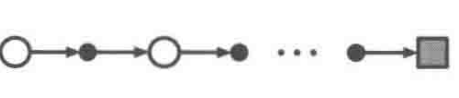
动态规划的回溯图显示了一步的所有转移，而蒙特卡洛的回溯图显示一幕所有采样到的转移。
#### 动作价值估计
将状态扩展为状态-动作二元组，即可预测动作的价值。
#### 柔性策略
柔性策略：采取任何动作的概率都为正。
1. 试探性出发（ES）：为采样部分无法正常获得的状态-动作二元组，可设定所有的状态-动作二元组都有概率作为起始。满足充分探索每个动作的理论要求，但是实际应用中很难实现。
2. $ \epsilon $-贪心策略：保证所有动作都有被选择的可能，同时靠近贪心策略。
$$
\pi(a|s) = 
\begin{cases} 
1 - \epsilon + \frac{\epsilon}{|\mathcal{A}|}, & \text{if } a = \arg\max_{a'} Q(s, a') \\
\frac{\epsilon}{|\mathcal{A}|}, & \text{otherwise}
\end{cases}
$$
#### 控制策略获取
在广义策略迭代中，维持策略评估，在策略改进时通过上述得到的动作价值函数贪婪选取。
#### 幕长
靠近目标的状态比远离目标的状态更早具有非零值，幕长应足够长，但无需无限长。
#### 优势
- 不需要环境动态特性模型。
- 蒙特卡洛对每个状态的估计是独立的，可以聚焦于状态子集，无需考虑其他状态。
- 可以从实际经历和模拟经历中学习。
- 在马尔可夫性不成立时性能损失较小。
### 2.同轨（on-policy）
采样并改进相同策略。
#### on-policy MC算法
- 参数：$ \epsilon > 0 $
- 初始化：
  - $ \forall s \in S, a \in A(s) $，任意初始化$ Q(s,a) \in R $，初始化$ Returns(s,a) $为空列表
  - $ 任意\epsilon $-greedy初始化的策略$ \pi $
- 循环（对每幕）：
  - 根据$ \pi $生成一幕序列：$ S_0,A_0,R_1,S_1,A_1,R_2,\dots,S_{T - 1},A_{T - 1},R_T $
  - $ G = 0 $
  - 循环（对每步）：$ t = T - 1, T - 2, \dots, 0 $
    - $ G = \gamma G + R_{t + 1} $ 
    - 未出现过的$ S_t $，将$ G $加入$ Returns(S_t,A_t) $，$ Q(S_t,A_t) = average(Returns(S_t,A_t)) $
    - $ A^* = \arg \max_a(Q(S_t,a)) $
    - $ \forall a \in A(S_t) $，$ \pi(a|S_t) $由\epsilon $-greedy选取
### 3.离轨（off-policy）
采样与改进不同策略，前者称为行为策略$ b $，后者称为目标策略$ \pi $，同轨可视为特殊的离轨。通过另设行为策略，可以在不使用$ \epsilon $-greedy策略时，保证对所有可能动作的采样。
#### 重要度采样
重要度采样比：计算回报时，对轨迹在目标策略和行为策略中出现的相对概率进行加权：
$$
\rho_{t:T - 1} = \Pi_{k = t}^{T - 1} \frac{\pi(A_k|S_k)}{b(A_k|S_k)}
$$
（由于转移概率相同，约分化简得到上式）

- 普通重要度采样：$ V(s) \doteq \frac{\sum_{t \in \tau(s)} \rho_{t:T(t) - 1}G_t}{|\tau(s)|} $，无偏但无界。
- 加权重要度采样：$ V(s) \doteq \frac{\sum_{t \in \tau(s)} \rho_{t:T(t) - 1}G_t}{\sum_{t \in \tau(s)} \rho_{t:T(t) - 1}} $，有偏但偏差值渐近收敛。

减小方差的方法：
- 折扣敏感：把折扣率$ \gamma $视作幕终止的概率，得到第$ n $步终止的无折扣部分回报$ \sum_{i = 1}^n R_{t + i} $，即平价部分回报。全回报$ G_t = \sum_{i = 1}^{T - t} \gamma^{i - 1}R_{t + i} $可视为各平价部分回报的加权和，即该步截止得到的回报与概率之积的和。适用于普通重要度采样和加权重要度采样。
- 每次决策型：$ E[\rho_{t:T - 1}G_t] = E[\tilde{G_t}] = E[\sum_{i = 1}^{T - t} \gamma^{i - 1} \rho_{t:t + i - 1}R_{t + i}] $。适用于普通重要度采样。
#### 增量式更新
$$ 
V_{n + 1} \doteq V_n + \frac{W_n}{C_n}[G_n - V_n] 
$$
$$
C_{n + 1} \doteq C_n + W_{n + 1}
$$
其中，$ W_i $是随机权重，$ C_i $是其累加和。
#### off-policy MC算法
- 初始化：$ \forall s \in S, a \in A(s), Q(s,a) \in R, C(s,a) = 0, \pi(s) = \arg \max_a Q(s,a) $
- 循环（对每幕）：
  - $ b $为任意柔性策略
  - 根据$ b $生成一幕序列：$ S_0,A_0,R_1,S_1,A_1,R_2,\dots,S_{T - 1},A_{T - 1},R_T $
  - $ G = 0 $
  - $ W = 1 $
  - 循环（对每步）：$ t = T - 1, T - 2, \dots, 0 $
    - $ G = \gamma G + R_{t + 1} $ 
    - $ C(S_t,A_t) = C(S_t,A_t) + W $
    - $ Q(S_t,A_t) = Q(S_t,A_t) + \frac{W}{C(S_t,A_t)}[G - Q(S_t,A_t)] $
    - $ \pi(S_t) = \arg \max_a Q(S_t,a) $
    - 如果$ A_t \neq \pi(S_t) $，退出内层循环
    - 否则，$ W = W\frac{1}{b(A_t|S_t)} $

潜在问题：贪心行为普遍，只会从幕的尾部学习；贪心行为不普遍，学习速度较慢。

---
## 六、时序差分（TD）
TD可以直接从与环境的互动中获取信息，不需要构建环境动态特性模型，同时运用自举思想，可以基于已得到的其他状态的估计值来更新当前状态的价值函数。相当于同时结合了DP和MC的优点。
### 1.时序差分——采样更新
MC必须等到一个幕的结尾才能确定增量，更新的是$ G_t $；而TD只需要等到下一时刻，更新的目标是$ R_{t + 1} + \gamma V(S_{t + 1}) $。

TD(0)，即单步TD的更新公式为：

$$
V_{t + 1}(S_t) = V_t(S_t) + \alpha_t(S_t)[R_{t + 1} + \gamma V_t(S_{t + 1}) - V_t(S_t)] 
$$

其中$ [R_{t + 1} + \gamma V_t(S_{t + 1}) - V_t(S_t)] $称为TD误差$ \delta_t $，其在$ t + 1 $时刻才能获得。其中的$ R_{t + 1} + \gamma V_t(S_{t + 1}) $称为TD目标。MC误差可写成TD误差之和，$ G_t - V(S_t) = \sum_{k = t}^{T - 1} \gamma^{k - t} \delta_k $，其在步长较小时成立。下图给出了相应的回溯图。

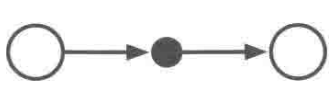
#### TD(0)算法
- 输入：待评估策略$ \pi $ 
- 参数：步长$ \alpha \in (0,1] $
- $ \forall s \in S^+ $，任意初始化$ V(s) $，$ V(\text{终止状态}) = 0 $
- 循环（对每幕）：
  - 初始化$ S $
  - 循环（对每步）
    - $ A $为策略$ \pi $在状态$ S $下做出的决策动作
    - 观察$ A $带来的$ R, S' $  
    - $ V(S) = V(S) + \alpha[R + \gamma V(S') - V(S)] $
    - $ S = S' $
  - 直到$ S $为终止状态
#### 随机游走
在随机任务实践中，TD(0)的收敛速度要比常量$ \alpha $MC快。这是因为前者的最优性与预测回报更相关，找出的是完全符合马尔可夫过程模型的最大似然估计参数，收敛到确定性等价估计；而后者只在有限方面最优，找出的是最小化训练集均方误差的估计。
#### 批量更新
价值函数根据增量和改变，在处理整批数据后才更新。
### 2.Sarsa（on-policy-TD）
Sarsa是TD算法的动作值版本：
$$
Q_{t + 1}(S_t, A_t) = Q_t(S_t, A_t) + \alpha_t[R_{t + 1} + \gamma Q_t(S_{t + 1}, A_{t + 1}) - Q_{t + 1}(S_t, A_t)]
$$

其中，$ Q(S_{t + 1}, A_{t + 1}) - Q(S_t, A_t) $是自学习。
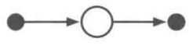
#### Sarsa算法
- 参数：步长$ \alpha \in (0,1] $，$ \epsilon > 0 $
- $ \forall s \in S^+ $，任意初始化$ Q(s,a) $，$ Q(\text{终止状态,}) = 0 $
- 循环（对每幕）：
  - 初始化$ S $
  - 使用从$ Q $得到的策略，在$ S $处选择$ A $
  - 循环（对每步）
    - 执行$ A $，观察$ R,S' $
    - 使用从$ Q $得到的策略，在$ S' $处选择$ A' $
    - $ Q(S, A) = Q(S, A) + \alpha [R + \gamma Q(S', A') - Q(S, A)] $
    - $ S = S', A = A' $
  - 直到$ S $为终止状态
#### 期望Sarsa
$$
Q_{t + 1}(S_t, A_t) = Q_t(S_t, A_t) + \alpha_t[R_{t + 1} + \gamma \sum_a \pi(a|S_{t+1}) Q_t(S_{t + 1}, a) - Q_t(S_t, A_t)],
$$

期望Sarsa相较Sarsa，虽然计算复杂，但是消除了随机选择带来的方差。$ \alpha $的选择对二者有一定影响，尤其在长期稳态性能上。生成策略可以基于相同或不同策略，即离轨或在轨是可变的。基于此，Q-learning可视为期望Sarsa的一个特例。
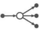
### 3.Q-learning（off-policy-TD）
Q-learning旨在求解动作值表示的贝尔曼最优方程。
$$
Q_{t + 1}(S_t, A_t) = Q_t(S_t, A_t) + \alpha_t[R_{t + 1} + \gamma \max_a Q_t(S_{t + 1}, a) - Q_t(S_t, A_t)]
$$

$ \max_a Q(S_{t + 1}, a) - Q(S_t, A_t) $是更丰富地学习。

#### Q-learning算法
- 参数：步长$ \alpha \in (0,1] $，$ \epsilon > 0 $
- $ \forall s \in S^+, a \in A(s) $，任意初始化$ Q(s,a) $，$ Q(\text{终止状态,}) = 0 $
- 循环（对每幕）：
  - 初始化$ S $
  - 循环（对每步）
    - 使用从$ Q $得到的策略，在$ S $处选择$ A $
    - 执行$ A $，观察$ R,S' $
    - $ Q(S, A) = Q(S, A) + \alpha [R + \gamma \max_a Q(S', a) - Q(S, A)] $
    - $ S = S' $
  - 直到$ S $为终止状态
### 4.DP、MC、TD对比
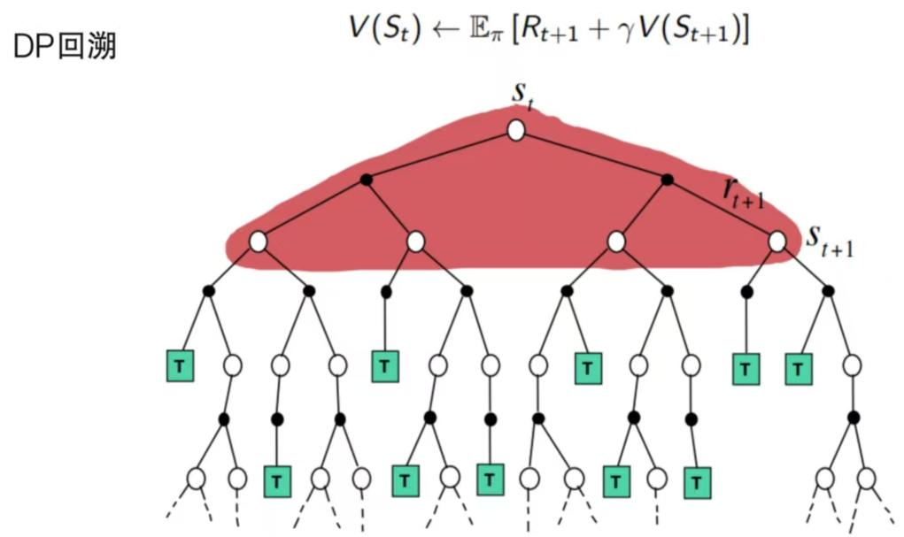
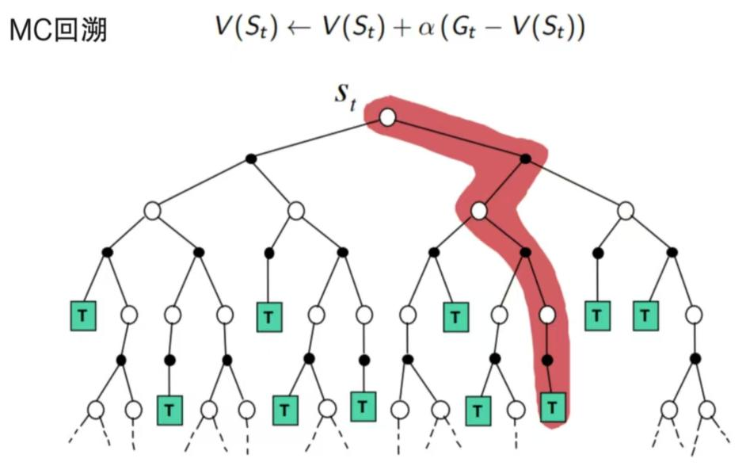
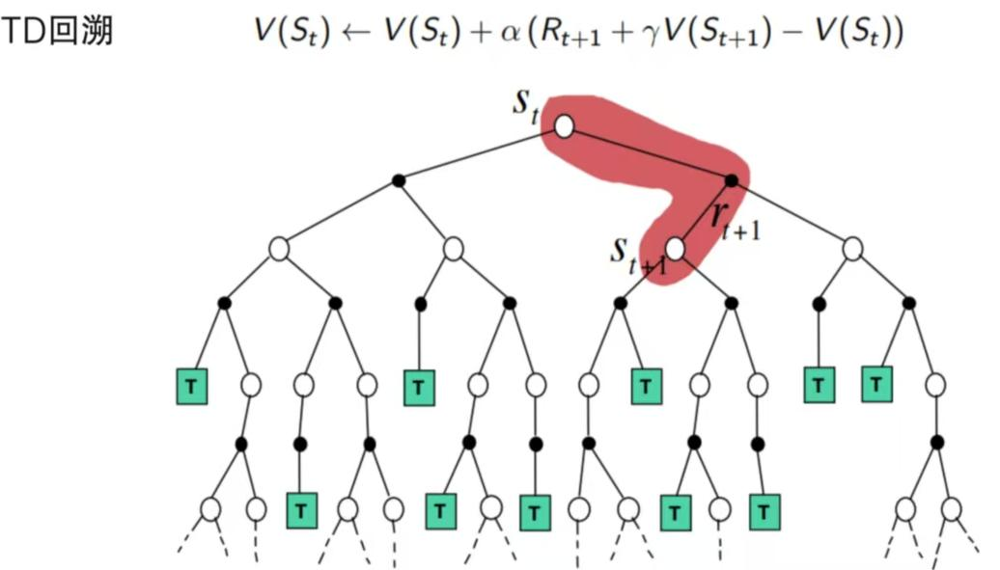
### 5.最大化偏差
贪心策略和柔性策略都在隐式估计最大值，会产生正偏差，这会致使回报值偏离，带来选择一些明显错误的决策。
#### 双学习
划分样本，学习两个独立的估计$ Q_1(a),Q_2(a) $，确定动作$ A* = \arg \max_a Q_1(a) $，再计算价值的估$ Q_2(A*) = Q_2(\arg \max_a Q_1(a)) $，后者是无偏的（可以交换再来一次）。需要双倍内存，但是计算量维持。
#### 双Q学习算法
- 参数：步长$ \alpha \in (0,1] $，$ \epsilon > 0 $
- $ \forall s \in S^+, a \in A(s) $，任意初始化$ Q_1(s,a),Q_2(s,a) $，$ Q(\text{终止状态,}) = 0 $
- 循环（对每幕）：
  - 初始化$ S $
  - 循环（对每步）
    - 基于$ Q_1 + Q_2 $，使用策略在$ S $处选择$ A $
    - 执行$ A $，观察$ R,S' $
    - 分别以$ 0.5 $的概率执行：
      - $ Q_1(S, A) = Q_1(S, A) + \alpha [R + \gamma Q_2(S', \arg \max_a Q_1(S',a)) - Q_1(S, A)] $
      - $ Q_2(S, A) = Q_2(S, A) + \alpha [R + \gamma Q_1(S', \arg \max_a Q_2(S',a)) - Q_2(S, A)] $
    - $ S = S' $
  - 直到$ S $为终止状态
#### 后位状态
利用先验知识，知晓动作后的状态，并有后位状态价值函数。在后位状态相同的时候，可以迁移，减少计算量。
### 6.总结对比
统一格式：
$$
Q_{t + 1}(S_t,A_t) = Q_t(S_t,A_t) + \alpha_t(S_t,A_t)[\bar{q}_t - Q_t(S_t,A_t)]
$$

其中
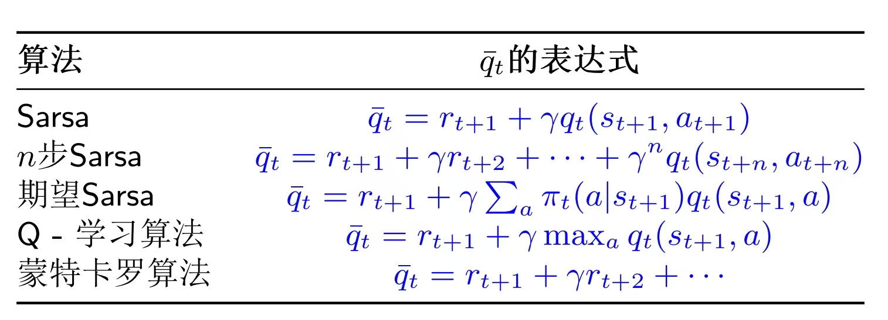

---
## 七、n步自举法
### 1.n步TD——预测
n步TD作为MC和TD的一般推广，在两种极端方法间找到了性能更好的平衡点。介于MC的整幕和TD的即时之间，n步TD在$ n $步后进行更新，截断得到$ n $步回报。
$$
G_{t:t+n} \doteq R_{t + 1} + \gamma R_{t + 2} + \dots + \gamma^{n - 1} R_{t + } + \gamma^n V_{t + n - 1}(S_{t + n})
$$

其中：
$$
V_{t + n}(S_t) \doteq V_{t + n - 1}(S_t) + \alpha[G_{t:t + n} - V_{t + n - 1}(S_t)]
$$

在$ t + n \geq T $时，即超出终止时间时，超出部分为$ 0 $。而在非更新步价值函数不会更新。

n步回报由于$ \gamma^n $这个系数的存在，误差要远远小于单步。
#### n步TD算法
- 输入：待评估策略$ \pi $ 
- 参数：步长$ \alpha \in (0,1] $，$ n \in N_+ $
- $ \forall s \in S $，任意初始化$ V(s) $
- 循环（对每幕）：
  - 初始化$ S_0 $，其非终止状态
  - $ T = \infty $
  - 循环$ t = 0, 1, 2, \dots $
    - $ t < T $
      - 根据$ \pi(·|S_t) $采取策略
      - 观察$ R_{t + 1}, S_{t + 1} $
      - 如果$ S_{t + 1} $是终止状态，则$ T = t + 1 $
    - $ \tau = t - n + 1 $
    - 如果$ \tau \geq 0 $
      - $ G = \sum_{i = \tau + 1}^{min(\tau + n, T)} \gamma^{i - r - 1}R_i $
      - 如果$ \tau + n < T $，$ G = G + \gamma^n V(S_{\tau + n}) $ 
      - $ V(S_{\tau}) = V(S_{\tau}) + \alpha[G - V(S_{\tau})] $
  - 直到$ \tau = T - 1 $
### 2.n步Sarsa——控制
n步Sarsa统一了Sarsa和MC，其节点转移全部基于采样得到的单独路径：
$$
Q_{t + n}(S_t, A_t) \doteq Q_{t + n - 1}(S_t, A_t) + \alpha [G_{t:t + n} - Q_{t + n - 1}(S_t, A_t)]
$$
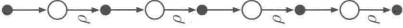

n步期望Sarsa只对最后一个状态到动作的转移展开：
$$
G_{t:t + n} \doteq R_{t + 1} + \gamma R_{t + 2} + \dots + \gamma^{n - 1} R_{t + n} + \gamma^n \bar{V}_{t + n - 1}(S_{t + n})
$$
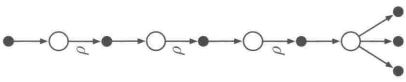
#### n步Sarsa算法
- 参数：步长$ \alpha \in (0,1] $，$ \epsilon > 0 $，$ n \in N_+ $
- $ \forall s \in S, a \in A $，任意初始化$ Q(s, a) $
- 初始化$ \pi $
- 循环（对每幕）：
  - 初始化$ S_0 $，其非终止状态
  - 根据$ \pi(·|S_0) $选取$ A_0 $
  - $ T = \infty $
  - 循环$ t = 0, 1, 2, \dots $
    - $ t < T $
      - 采取$ A_t $，观察$ R_{t + 1}, S_{t + 1} $
      - 如果$ S_{t + 1} $是终止状态，则$ T = t + 1 $；否则根据$ \pi(·|S_{t + 1}) $选取$ A_{t + 1} $
    - $ \tau = t - n + 1 $
    - 如果$ \tau \geq 0 $
      - $ G = \sum_{i = \tau + 1}^{min(\tau + n, T)} \gamma^{i - r - 1}R_i $
      - 如果$ \tau + n < T $，$ G = G + \gamma^n Q(S_{\tau + n}, A_{\tau + n}) $ 
      - $ Q(S_{\tau},A_{\tau}) = Q(S_{\tau},A_{\tau}) + \alpha[G - Q(S_{\tau},A_{\tau})] $
  - 直到$ \tau = T - 1 $
### 3.n步off-policy
针对离线n步时序差分学习，有：
$$
V_{t + n}(S_t) \doteq V_{t + n - 1}(S_t) + \alpha \rho_{t:t + n - 1}[G_{t:t + n} - V_{t + n - 1}(S_t)]
$$

其中，重要度采样率为目标策略和行为策略采取$ n $个动作的相对概率：
$$
\rho_{t:h} \doteq \Pi_{k = t}^{\min(h,T - 1)} \frac{\pi(A_k|S_k)}{b(A_k|S_k)}
$$
#### 离轨n步期望Sarsa算法
- 输入：行为策略$ b, b(a|s) > 0 $
- 参数：步长$ \alpha \in (0,1] $，$ \epsilon > 0 $，$ n \in N_+ $
- $ \forall s \in S, a \in A $，任意初始化$ Q(s, a) $
- 初始化$ \pi $
- 循环（对每幕）：
  - 初始化$ S_0 $，其非终止状态
  - 根据$ b(·|S_0) $选取$ A_0 $
  - $ T = \infty $
  - 循环$ t = 0, 1, 2, \dots $
    - $ t < T $
      - 采取$ A_t $，观察$ R_{t + 1}, S_{t + 1} $
      - 如果$ S_{t + 1} $是终止状态，则$ T = t + 1 $；否则根据$ b(·|S_{t + 1}) $选取$ A_{t + 1} $
    - $ \tau = t - n + 1 $
    - 如果$ \tau \geq 0 $
      - \rho = \Pi_{i = \tau + 1}^{\min(\tau + n - 1,T - 1)} \frac{\pi(A_i|S_i)}{b(A_i|S_i)}
      - $ G = \sum_{i = \tau + 1}^{min(\tau + n, T)} \gamma^{i - r - 1}R_i $
      - 如果$ \tau + n < T $，$ G = G + \gamma^n Q(S_{\tau + n}, A_{\tau + n}) $ 
      - $ Q(S_{\tau},A_{\tau}) = Q(S_{\tau},A_{\tau}) + \alpha \rho[G - Q(S_{\tau},A_{\tau})] $
  - 直到$ \tau = T - 1 $
### 4.带控制变量的每次决策模型
为保证不被选择的动作不会因$ \rho_t = 0 $而回报为$ 0 $，使方差较大，采取以下n步回报离轨方法：
$$
G_{t:h} \doteq \rho_t (R_{t+1} + \gamma G_{t + 1:h}) + (1 - \rho_t) V_{h - 1}(S_t)
$$

其中$ (1 - \rho_t) V_{h - 1}(S_t) $称为控制变量，其能保证$ \rho_t = 0 $时估计值不收缩，但不会改变更新值的期望。

使用控制变量的离轨策略可以写为以下递归形式：
$$
G_{t:h} 
\doteq R_{t + 1} + \gamma[\rho_{t + 1} G_{t + 1:h} + \bar{V}_{h - 1}(S_{t + 1}) - \rho_{t + 1} Q_{h - 1}(S_{t + 1}, A_{t + 1})] \\
= R_{t + 1} + \gamma \rho_{t + 1}[G_{t + 1:h} - Q_{h - 1}(S_{t + 1}, A_{t + 1})] + \gamma \bar{V}_{h - 1}(S_{t + 1})
$$
#### n步树回溯算法——不需要重要度采样的离轨方法
离轨因为所学内容相关性小，比同轨缓慢，一些方法可以缓解这一问题，比如不使用重要度采样的树回溯算法。相比于前面以沿途收益和底部节点估计价值为更新目标的算法，树回溯的更新源于整个树的动作价值估计，即各叶子节点的动作价值估计按出现概率加权。

单步回溯树：
$$
G_{t:t + 1} \doteq R_{t + 1} + \gamma \sum_{a} \pi(a|S_{t + 1}) Q_t(S_{t + 1}, a)
$$

拓展到n步回溯树的递归形式，其对路径可能分支进行展开，不进行采样：
$$
G_{t:t + n} \doteq R_{t + 1} + \gamma \sum_{a \neq A_{t + 1}} \pi(a|S_{t + 1}) Q_{t + n - 1}(S_{t + 1}, a) + \gamma \pi(A_{t + 1}|S_{t + 1}) G_{t + 1:t + n}
$$

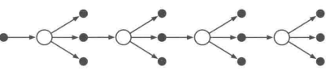

这个目标可以用于n步Sarsa的动作价值更新。
#### n步树回溯算法
- 参数：步长$ \alpha \in (0,1] $，$ n \in N_+ $
- $ \forall s \in S, a \in A $，任意初始化$ Q(s, a) $
- 初始化$ \pi $
- 循环（对每幕）：
  - 初始化$ S_0 $，其非终止状态
  - 根据$ S_0 $任意选取$ A_0 $
  - $ T = \infty $
  - 循环$ t = 0, 1, 2, \dots $
    - $ t < T $
      - 采取$ A_t $，观察$ R_{t + 1}, S_{t + 1} $
      - 如果$ S_{t + 1} $是终止状态，则$ T = t + 1 $；否则根据$ S_{t + 1} $选取$ A_{t + 1} $
    - $ \tau = t - n + 1 $
    - 如果$ \tau \geq 0 $
      - 如果$ t + 1 \geq T $，G = R_T，否则$ G = R_{t + 1} + \gamma \sum_a \pi(a|S_{t + 1})Q(S_{t + 1},a) $
      - 循环$ k = min(t, T - 1) $递减到$ \tau + 1 $，$ G = R_k + \gamma \sum_{a \neq A_k} \pi(a|S_k)Q(S_k,a) + \gamma \pi(A_k|S_k)G $
      - Q(S_{\tau},A_{\tau}) = Q(S_{\tau},A_{\tau}) + \alpha[G - Q(S_{\tau},A_{\tau})]
  - 直到$ \tau = T - 1 $
### 5.n步Q(sigma)算法
结合采样的Sarsa和展开的树回溯，在每个状态由参数$ \sigma $决定是采样还是展开，即n步Q$ (\sigma) $算法，其将两种线性情况组合起来：
$$
G_{t:h} \doteq R_{t + 1} + \gamma (\sigma_{t + 1} \rho_{t + 1} + (1 - \sigma_{t + 1}) \pi(A_{t + 1}|S_{t + 1}))(G_{t + 1:h} - Q_{h - 1}(S_{t + 1}, A_{t + 1})) + \gamma \bar{V}_{h - 1}(S_{t + 1})
$$

回溯图.png)
#### n步离轨Q(sigma)算法（n步Sarsa更新）
- 输入：行为策略$ b, b(a|s) > 0 $
- 参数：步长$ \alpha \in (0,1] $，$ \epsilon > 0 $，$ n \in N_+ $
- $ \forall s \in S, a \in A $，任意初始化$ Q(s, a) $
- 初始化$ \pi $
- 循环（对每幕）：
  - 初始化$ S_0 $，其非终止状态
  - 根据$ b(|S_0) $选取$ A_0 $
  - $ T = \infty $
  - 循环$ t = 0, 1, 2, \dots $
    - $ t < T $
      - 采取$ A_t $，观察$ R_{t + 1}, S_{t + 1} $
      - 如果$ S_{t + 1} $是终止状态，则$ T = t + 1 $；否则根据$ b(|S_{t + 1}) $选取$ A_{t + 1} $，选择$ \sigma_{t + 1} $，计算$ \rho_{t + 1} = \frac{\pi(A_{t + 1}|S_{t + 1})}{b(A_{t + 1}|S_{t + 1})} $
    - $ \tau = t - n + 1 $
    - 如果$ \tau \geq 0 $
      - G = 0
      - 循环$ k = min(t, T - 1) $递减到$ \tau + 1 $
        - $ k = T $，则$ G = R_T $；否则，$ \bar{V} = \sum_a \pi(a|S_k)Q(S_k,a) $，$ G = R_k + \gamma[\sigma_k \rho_k + (1 - \sigma_k)\pi(A_k|S_k)][G - Q(S_k|A_k)] + \gamma\bar{V} $
      - $ Q(S_{\tau},A_{\tau}) = Q(S_{\tau},A_{\tau}) + \alpha[G - Q(S_{\tau},A_{\tau})] $
  - 直到$ \tau = T - 1 $

---
## 八、基于表格型方法的规划和学习
基于模型的方法（DP、启发式搜索）主要进行规划，无模型的方法（MC、TD）则主要进行学习，二者的核心都是价值函数的计算。
### 1.模型和规划
#### 模型
- 分布模型：生成所有可能的结果的描述与概率分布。
- 样本模型：从所有可能中生成一个确定的结果，其通过概率分布采样得到。
- 分布模型可以生成样本模型，但是样本模型一般更容易获得。
#### 规划
- 规划：以环境模型为输入，生成或改进与其进行交互的策略。
- 状态空间规划：在状态空间搜索最优策略。
- 方案空间规划：进化算法、偏序规划。
#### 统一的状态空间规划算法
通过仿真经验的回溯操作计算价值函数，将其作为改善策略的中间步骤。

各算法的差异集中在回溯操作，执行操作顺序、回溯信息保留时长上。

极小步长适于大尺度规划问题。
#### 随机采样单步表格型Q规划算法
- 循环：
  - 随机选择$ s \in S, a \in A(s) $
  - 采样$ (s, a) $的$ r,s' $
  - 规划：$ Q(s, a) = Q(s, a) + \alpha[r + \gamma \max_aQ(s', a) - Q(s, a)] $
### 2.Dyna-Q
#### 框架
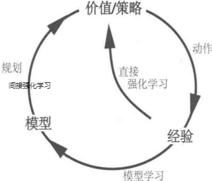
- 间接强化学习：更充分地利用有限经验，获得更好的策略，减少与环境的交互作用。
- 直接强化学习：不受模型设计偏差影响。

Dyna-Q中，学习和规划由相同算法完成，真实经验用于学习，模拟经验用于规划。
#### 表格型Dyna-Q算法
- $ \forall s \in S, a \in A(s) $，初始化$ Q(s, a),Model(s, a) $（基于$ (s, a) $预测的后继状态和收益）
- 循环：
  - $ S $为当前状态，其非终止状态
  - 基于$ (S,Q) $选取$ A $
  - 采取$ A $，观察$ R,S' $
  - $ Q(s, a) = Q(s, a) + \alpha[R + \gamma \max_aQ(s', a) - Q(s, a)] $
  - $ Model(s, a) = R,S' $
  - 循环n次：
    - 随机选择观测过的$ S $和其下采取过的$ A $
    - $ R,S' = Model(S, A) $
    - $ Q(s, a) = Q(s, a) + \alpha[R + \gamma \max_aQ(s', a) - Q(s, a)] $
### 3.改进方法
#### 模型错误
鼓励长期未出现过的动作，这些动作的模型可能是不正确的。通过鼓励试探所有可访问的状态转移，规避在次优解收敛。
#### 优先遍历
相比于均匀采样无长期收益的动作，集中更新有收益的动作会更有意义。反向聚焦提供了相应的思路。关联前导动作和前导状态，在后续动作有收益时先更新前导动作的价值，进行有效更新。按照价值改变多少对状态-动作二元组进行优先级排序，并由后至前反向传播出高影响序列。优先遍历为提高规划销量分配了计算量，但由于采用期望更新而在随机环境中有所局限。
#### 确定性环境下的优先级遍历算法
- $ \forall s \in S, a \in A(s) $，初始化$ Q(s, a),Model(s, a) $，初始化$ PQuene $为空
- 循环：
  - $ S $为当前状态，其非终止状态
  - 基于$ (S,Q) $选取$ A $
  - 采取$ A $，观察$ R,S' $
  - $ Model(s, a) = R,S' $
  - $ P = |R + \gamma \max_a Q(S',a) - Q(S,a)| $
  - $ P > 0 $将$ (S,A) $以优先级$ P $插入$ PQuene $
  - 循环n次（$ PQuene $非空）：
    - $ S,A = PQuene(0) $ 
    - $ R,S' = Model(S, A) $
    - $ Q(s, a) = Q(s, a) + \alpha[R + \gamma \max_aQ(s', a) - Q(s, a)] $
    - 对可达$ S $的$ \bar{S},\bar{A} $进行上述迭代
#### 轨迹采样
借助模拟生成经验来进行回溯更新称为轨迹采样。同轨策略轨迹采样对于大尺度问题有一定优势，能够跳过无关状态，获得最优部分策略。

实时动态规划（RTDP）是价值迭代算法的同轨策略轨迹采样版本，属于异步DP。它可以在较少访问频率下为一些任务找到最优策略，并且产生轨迹所用的策略也会接近最优策略。
#### 启发式搜索
聚焦于当前状态。
#### 预演算法
作为MC的一个特例，通过平均多个起始于可能动作并遵循给定策略的模拟轨迹的回报来估计动作价值，可以改进预演策略的性能。

蒙特卡洛树搜索（MCTS）作为一种预演算法，通过累积蒙特卡洛模拟得到的价值估计来不停地将模拟导向高收益轨迹。其一次循环中包含选择、扩展、模拟、回溯四个步骤。
### 4.总结对比
#### 三个维度
- 更新
- 自举程度
- 同轨/离轨
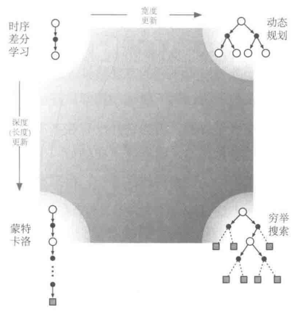
#### 更新
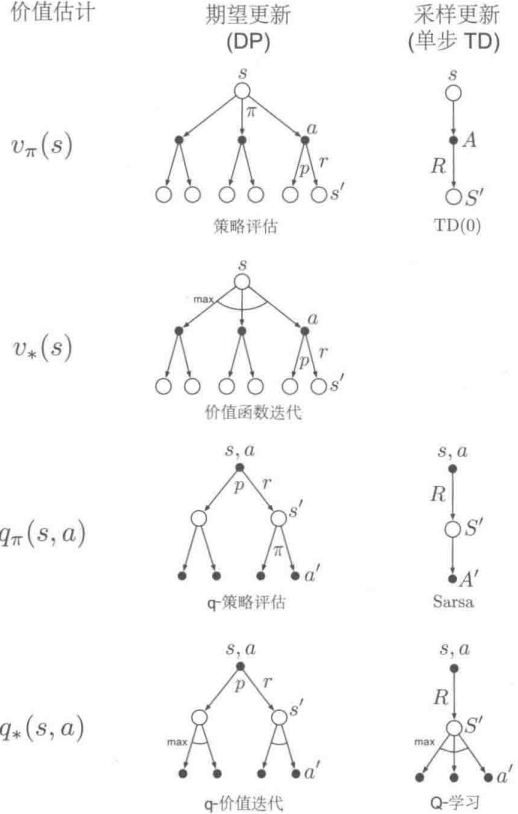

期望更新能产生更好的估计，但是需要更多的计算。
#### 规划
- 后台规划：从环境模型生成模拟经验，改进策略或价值函数
  - 表格型方法
  - 近似方法
- 决策时规划：使用模拟经验为当前状态选择动作

---
## ​附录：数学基础
### 1.概率空间​$ (\Omega, F, P) $
- 非负性：$ \forall A \in F,P(A) \geq 0 $。
- 规范性：$ P(\Omega) = 1 $。
- 可列可加性：若$ A_1, A_2, \dots $互斥，则$ P\left(\bigcup_{i=1}^{\infty} A_i\right) = \sum_{i=1}^{\infty} P(A_i) $。
- ​补集：$ P(A^c) = 1 - P(A) $。
- ​交集：$ P(A \cap B) = P(A) + P(B) - P(A \cup B) $。
### 2.​随机变量
- 离散型：
  - ​概率质量函数(PMF)：$ P(X = x) = p(x) $，满足 $ \sum_{x} p(x) = 1 $。
  - ​期望：$ E[X] = \sum_{x} x p(x) $。
  - ​方差：$ Var(X) = \mathbb{E}[(X - \mathbb{E}[X])^2] $。
- 连续型：
  - ​概率密度函数(PDF)：$ f(x) \geq 0 $，满足$ \int_{-\infty}^{\infty} f(x), dx = 1 $。
  - ​期望：$ \mathbb{E}[X] = \int_{-\infty}^{\infty} x f(x), dx $。
  - ​方差：$ Var(X) = \mathbb{E}[(X - \mathbb{E}[X])^2] $。
### 3.条件概率与独立性
- ​条件概率：$ P(B|A) = \frac{P(A \cap B)}{P(A)}, \text{当} P(A) > 0 $。
- 全概率公式：$ P(B) = \sum_{A \subseteq F} P(B|A) P(A) $，适用于互斥且穷尽的事件$ A $。
- 贝叶斯定理：$ P(A|B) = \frac{P(B|A) P(A)}{P(B)} $。
- 独立性： $ A $、$ B $独立$ \iff P(A \cap B) = P(A)P(B) $。
- ​条件独立：$ P(A ,B|C) = P(A|C)P(B|C) $。
### 4.马尔可夫链与转移概率
- 马尔可夫性：$ P(S_{t+1}|S_t, S_{t-1}, \dots, S_0) = P(S_{t+1}|S_t) $。 
- 转移矩阵：状态空间$ S $，转移概率矩阵为$ P \in [0,1]^{S \times S} $，其中：$ P(s'|s) = P(s' \to s) = \sum_{a} P(s'|s, a) P(a|s) $。
- 平稳分布：$ \pi = \pi P $，即$ \pi(s') = \sum_{s} \pi(s) P(s'|s), \forall s' \in S $。
### 5.大数定律与中心极限定理
- 大数定律(Law of Large Numbers) 
  - ​弱大数律：$ \frac{1}{n} \sum_{i=1}^n X_i \xrightarrow{p} \mathbb{E}[X] $。
  - ​强大数律：$ \frac{1}{n} \sum_{i=1}^n X_i \xrightarrow{  a.s.} \mathbb{E}[X] $。
- 中心极限定理(Central Limit Theorem) 
$ X_1, X_2, \dots $独立同分布，均值为$ \mu $，方差为$ \sigma^2 < \infty $，则  
$ \frac{1}{\sqrt{n}} \sum_{i=1}^n (X_i - \mu) \xrightarrow{d} N(0, \sigma^2) $。
### 6.泛函分析
- 期望的线性：​$ \mathbb{E}[aX + bY] = a \mathbb{E}[X] + b \mathbb{E}[Y] $。
- ​协方差：$ Cov(X, Y) = \mathbb{E}[(X - \mu_X)(Y - \mu_Y)] = \mathbb{E}[XY] - \mu_X \mu_Y $。
- 相关系数：$ \rho(X, Y) = \frac{\text{Cov}(X, Y)}{\sigma_X \sigma_Y} $。